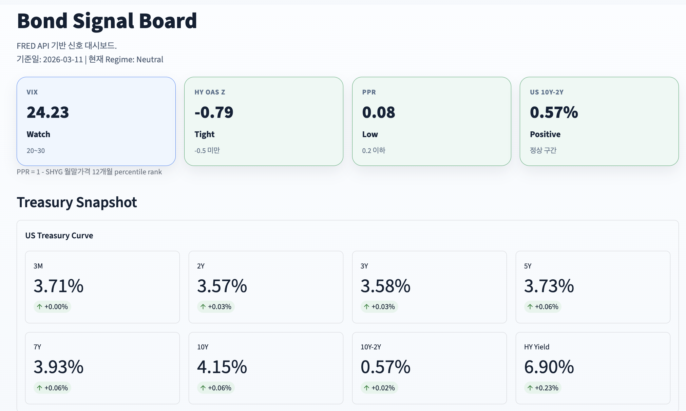
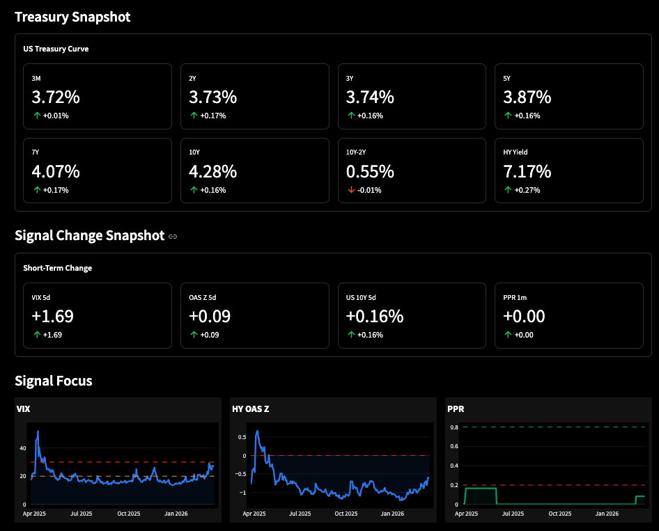

# Bond Signal Dashboard

FRED API와 시장 데이터 기반으로 채권/리스크 신호를 시각화하는 Streamlit 대시보드입니다.

## Preview

대시보드 스크린샷 두 장을 아래처럼 함께 확인할 수 있습니다.




## Features

- FRED 시계열 기반 금리, VIX, 하이일드 스프레드 모니터링
- SHYG 기반 PPR(Percentile Position Risk) 계산
- `Risk On / Neutral / Risk Off` regime 분류
- 카드형 요약 지표와 시계열 차트 제공

## Stack

- Python
- Streamlit
- Pandas / NumPy
- Plotly
- FRED API
- yfinance

## Setup

```bash
python -m venv .venv
source .venv/bin/activate
pip install -r requirements.txt
```

프로젝트 폴더에 `.env` 파일을 만들고 FRED API 키를 넣습니다.

```env
FRED_API_KEY=your_api_key
```

## Run

```bash
streamlit run dashboard.py
```

앱은 접속 시 자동으로 데이터를 불러옵니다.

## Share As Web Page

가장 빠른 방법은 Streamlit Community Cloud 배포입니다.

1. 이 폴더를 GitHub 저장소로 푸시합니다.
2. [Streamlit Community Cloud](https://share.streamlit.io/)에서 GitHub 저장소를 연결합니다.
3. Main file path를 `dashboard.py`로 지정합니다.
4. 앱 설정의 Secrets에 아래 값을 넣습니다.

```toml
FRED_API_KEY="your_api_key"
```

배포가 끝나면 공개 URL이 생성되고, 그 링크를 그대로 사람들에게 공유하면 됩니다.

## Environment Notes

- 로컬 실행: `.env`의 `FRED_API_KEY` 사용
- Streamlit Cloud 배포: `secrets`의 `FRED_API_KEY` 사용

## Repo Name

- `bond-signal-dashboard`
